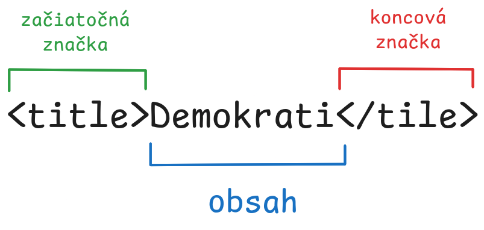

# Digitálna zbierka slovenskej prózy (prípadová štúdia) {#sec:dispro labe="Digitálna zbierka slovenskej prózy"}

V tejto kapitole opisujeme vývoj digitálneho korpusu slovenskej prózy vydanej
pred rokom 1950, pričom osobitnú pozornosť v nej venujeme prieniku literárnej
vedy a prostriedkov výpočtových technológií. Cieľom projektu bolo zostaviť
reprezentatívnu a na výskum pripravenú zbierku beletristickej prózy, ktorá by
odrážala formálny, tematický a jazykový vývoj slovenskej literatúry od
polovice 19. storočia do začiatku povojnového obdobia. Korpus, ktorý čerpal z
rôznych archívnych zdrojov - vrátane Slovenskej národnej knižnice, univerzitných
repozitárov, jazykovedného inštitútu SAV a historických vydavateľských
záznamov - pozostáva z desiatok XML súborov zodpovedajúcich schéme TEI [^1]
podporujúcej prístupy blízkeho aj vzdialeného čítania. Tento štruktúrovaný súbor
údajov umožňuje celý rad vedeckých výskumov, od štylistickej analýzy a
klasfikácie žánrov až po sieťové modelovanie autorských a publikačných kontextov.
Namiesto vytvárania uzavretého kánonu projekt poskytuje otvorenú platformu na
skúmanie literárnej histórie prostredníctvom počítačových nástrojov, pričom
zostáva zakotvený v interpretačných tradíciách humanitných vied.

[^1]: Text Encoding Initiative

## Opis výskumného projektu

## Technologické minimum

### XML

V digitálnych humanitných vedách nie je výber formátu na reprezentáciu textových
údajov neutrálnym rozhodnutím, pretože určuje, čo môžeme s textom robiť, ako ho
interpretujeme a ako ho zdieľame s ostatnými. Medzi voľby, ktorá sú zrejme
najbližšie bežnému užívateľovi, patria formáty textových procesorov, ako
napríklad .docx programu Microsoft Word alebo .odt súbory používané v
OpenOffice. Tie ponúkajú vizuálne orientované prostredie, v ktorom
môžu používatelia písať, upravovať a formátovať texty bez potreby
hlbších
technických znalostí. Funkcie ako tučné písmo, kurzíva, poznámky pod čiarou a
nadpisy sú vďaka intuitívnemu užívateľskému rozhraniu ľahko použiteľné a
spoluprácu s ďalšími ľuďmi zjednodušujú integrované funkcie komentovania alebo
systémy sledovania zmien. Pri bežnom narábaní s textom v digitálnom prostredí sú
vďaka takejto jednoduchosti používania procesory jasnou voľbou.

Táto voľba však so sebou nesie určité obmedzenia, pre ktoré nie sú textové
procesory, resp. súborové formáty, ktorými tieto programy reprezentujú texty,
vhodné pre ciele, ktoré sledujeme v digitálnych humanitných vedách. Tieto
obmedzenia nie sú len technickými prekážkami, ale ovplyvňujú aj spôsob
interpretácie, zdieľania a uchovávania textov vo vedeckej práci, ktorá čoraz
viac závisí od štruktúrovaných, pre počítače zrozuminteľných údajov.

Jedným z najzásadnejších problémov je, že textové procesory sú navrhnuté s
ohľadom na vizuálnu prezentáciu textov, nie vzhľadom na ich sémantickú zrozumiteľnosť.
Funkcie formátovania textu, ktoré tieto programy poskytujú, sú zamerané na to,
ako text vyzerá pre čitateľa: tučné písmo pre zvýraznenie, kurzíva pre nadpisy,
zalomenie riadkov pre odseky. Táto prezentácia však v sebe nenesie
žiadne informácie o význame alebo funkcii danej časti textu. Tučným písmom
zvýraznený výraz v programe Word môže označovať rečníka v divadelnej hre,
postavu v románe alebo nadpis v odbornom článku, čo stroj, bez ďalšej
informácie, nemôže vedieť. Absencia sémantického značenia veľmi sťažuje
extrakciu, analýzu alebo opakované spracovanie textu pomocou výpočtovej techniky.
Aj keď je vizuálne formátovanie konzistentné, základná štruktúra súboru je
zvyčajne neprehľadná, keďže je uložená ako zazipovaná zbierka binárnych súborov,
ktoré je ťažké analyzovať bez špecializovaných nástrojov.

Okrem toho sú súbory textových procesorov často nekonzistentné a
idiosynkratické. Používatelia volia rôzne formátovanie v závislosti od
osobných zvykov, inštitucionálnych šablón alebo predvolených nastavení softvéru.
Jedna vedkyňa môže používať kurzívu pre názvy kníh, iný môže používať úvodzovky.
Niektorí môžu ručne vkladať zalomenia riadkov, aby vytvorili dojem medzier, iní
sa spoliehajú na štýly. Tieto nezrovnalosti sa v spoločných alebo rozsiahlych
projektoch rýchlo hromadia, takže automatizované spracovanie alebo analýza sú
bez rozsiahleho čistenia a štandardizácie nespoľahlivé.

Ďalšou nevýhodou je netransparentnosť verziovania zmien súborov textového procesora.
Word síce ponúka funkcie ako „sledovanie zmien“, tie však nie sú štandardizované
ani prenosné medzi rôznymi platformami.

Z hľadiska uchovávania nie sú formáty textových procesorov veľmi robustné. Keďže sa
spoliehajú na proprietárne alebo poloproprietárne technológie, sú náchylné na
zastarávanie softvéru alebo zmeny v predvolenom správaní v jeho rôznych verziách.
Súbor .docx vytvorený v programe Word 2007 sa nemusí správať rovnako v novších
verziách alebo v open-source alternatívach, čo môže viesť k strate údajov, neželaným
zmenám vo formátovaní alebo v rozložení textu.

Napokon, pre projekty digitálnych humanitných vied, ktorých cieľom je publikovať
texty na webe, prepojiť ich s metadátami alebo zabezpečiť ich plnotextovú
vyhľadateľnosť a analyzovateľnosť, sú súbory textového procesora jednoducho
nevyhovujúce. Konverzia súborov .docx do vhodne štruktúrovaných formátov si zvyčajne
vyžaduje buď množstvo manuálnej práce alebo použitie externých nástrojov, akým
je napríklad program Pandoc, prípadne vlastné skripty - ani tie nám však
nepomôžu, ak nemá pôvodný súbor konzistentnú štruktúru.

Hoci teda formáty textových procesorov vyhovujú potrebám bežného písania a
akademického publikovania^[Predchádzajúce a nasledovné argumenty však poskytujú
dôvody v neprospech týchto formátov aj pre tieto použitia.], ich obmedzenia sa
naplno prejavia vo vzťahu k požiadavkám práce v oblasti digitálnych humanitných
vied - konkrétne k potrebe modelovať, analyzovať a uchovávať texty bohatým a
štruktúrovaným spôsobom. Práve tu ponúka XML (eXtensible Markup Language)
robustnú alternatívu. Je to jazyk navrhnutý na reprezentáciu informácií v
štruktúrovanom, pre človeka a počítač čitateľnom formáte. Pri jeho návrhu sa
kládol dôraz najmä na jednoduchosť, všeobecnosť a použiteľnosť v prostredí
internetu[@extensible2025] a vyznačuje sa silnou podporou takmer všektých
ľudských jazykov vďaka kompatibilite s Unicode štandardom.^[Ide o univerzálne
kódovanie znakov určené na podporu celosvetovej výmeny, spracovania a
zobrazovania písaných textov rôznych jazykov a technických disciplín moderného
sveta.[@unicode2025]] Hoci mal jazyk XML pôvodne slúžiť najmä na reprezentáciu
dokumentov, v súčasnosti sa extenzívne používa na reprezentáciu ľubovoľných
dátových štruktúr,[@fennell_extremes_2013] napríklad tých, ktoré sa vyskytujú vo
webových službách.[@whatisxml2025]

#### Sémantická jasnosť a explicitná štruktúra

Jednou z najvýznamnejších výhod jazyka XML je schopnosť sémantického
značkovania. Na rozdiel od súborov textových procesorov, ktoré používajú
formátovanie predovšetkým na vizuálnu prezentáciu textu, XML umožňuje
explicitné definovanie sémantického významu jednotlivých častí textu. Ak
chceme, napríklad, v nejakom texte zaznamenať, že určitý reťazec znakov
predstavuje meno autora, prostriedkami XML to dosiahneme tak, že danú pasáž
uzavrieme v značke ```<author>```^[Technickým detailom XML sa venujeme
nižšie.], ktorá má vopred definovaný význam.^[V tomto kontexte
by mohlo ísť o význam "tvorca textu, ktorého je označený reťazec časťou".] Týmto sa
stane rola daného reťazca v dokumente explicitná a jednoznačná.

Táto jasnosť sa zreteľnejšie ukáže pri komplexnejších príkladoch. Historický
dokument môže obsahovať vrstvené úrovne citácií, redakčných a autorských
poznámok, odkazov alebo marginálií - každý z týchto prvkov možno presne
reprezentovať označením pomocou prostriedkov XML. Vďaka tomu tak výskumníci môžu
systematicky vyhľadávať prípady konkrétneho hovorcu, sledovať pomenované entity,
identifikovať tematické vzory alebo rozlišovať medzi pôvodným textom a
redakčnými zásahmi.

XML tak slúži ako nástroj pre formalizované vyjadrenie vedeckej interpretácie.
Zviditeľňuje štrukturálne a interpretačné rozhodnutia, ktoré humanisti často
nechávajú v ich tradičnej vedeckej produkcii implicitné. To sa obzvlášť dobre
zhoduje s cieľmi tvorby kritických edícií a archívnej práce všeobecne, kde je
prvoradá vernosť materiálnemu a intelektuálnemu kontextu.

#### Interoperabilita a znovupoužiteľnosť

Ďalšou kľúčovou výhodou XML je jeho interoperabilita. Keďže je nezávislý od
výpočtovej platformy a riadi sa otvorenými štandardmi, súbory tohto formátu
možno používať v širokom spektre softvérových prostredí, od databáz a webových
aplikácií až po transformačné systémy a nástroje na vizualizáciu údajov.

Súbor vo formáte XML možno napríklad transformovať do HTML formátu určeného na
publikovanie na webe, PDF formátu vhodného pre tlač, formátu ePub používaného v
elektronických čítačkách alebo dokonca do formátu JSON na integráciu do webových
rozhraní v internetovom prostredí. Tieto transformácie sa zvyčajne realizujú pomocou XSLT ^[XSLT
(Extensible Stylesheet Language Transformations) je jazyk pôvodne navrhnutý na
transformáciu dokumentov XML do iných XML dokumentov alebo iných formátov, ako
je HTML, obyčajný text alebo formátovacie objekty XSL. Tieto formáty možno
následne konvertovať do formátov, ako sú PDF, PostScript a PNG. Podpora
transformácie JSON a obyčajného textu bola pridaná v neskorších aktualizáciách
špecifikácie XSLT 1.0.[@xslt2025]] alebo iných transformačných
"potrubí"^[Postupnosť automatizovaných krokov alebo procesov, ktoré konvertujú
údaje z jedného formátu alebo štruktúry do iného.], vďaka čomu môže jeden súbor
slúžiť ako zdroj pre generovania množstva rôznych výstupov bez vynakladania
duplicitnej práce.

Okrem toho, keďže sa XML sa riadi striktnými pravidlami a súbory v tomto
formáte môžeme validovať voči vopred definovaným modelom, je ľahké udržiavať
texty dobre utvorené a vnútorne konzistentné. Toto zabezpečuje opakovateľnú
použiteľnosť a zdieľateľnosť korpusov pozostávajúcich z XML súborov - nielen
pôvodnými autormi, ale aj inými výskumníkmi a inštitúciami.

#### Strojová čitateľnosť a analýza

Vďaka hierarchickej a na pravidlách založenej štruktúre XML, poskytujú súbory v tomto
formáte ideálny substrát pre dištančné čítanie, stylometriu, sieťovú
analýzu, modelovanie tém a ďalšie metódy používané v digitálnych
humanitných vedách. Vhodne anotované texty nám napríklad umožňujú ľahko
zodpovedať otázky ako koľko ženských postáv hovorí v slovenských románoch z 19.
storočia, ako často sa objavujú odkazy na určité miesta alebo ako sa mení
štruktúra dialógov v čase. Na tieto typy otázok je takmer nemožné spoľahlivo
odpovedať pri použití formátov textového procesora, ktoré nemajú vnútornú
štruktúru potrebnú na to, aby boli vhodnými vstupmi pre automatizované
spracovanie.

#### Transparentnosť a uchovávanie

Keďže XML je čisto textový formát^[Máme tu na mysli to, čo sa v anglickom jazyku
    označuje ako "plain text", teda dáta, ktoré obsahujú len reprezentácie
    znakov čitateľného materiálu bez ich grafickej reprezentácie alebo ďalších
objektov (čísiel, s pohyblivovu desatinnou čiarkou, obrázkov, atď.) Niekedy sa
    síce XML považuje za tzv. bohatý text ("rich text"), keďže okrem
    reprezentácií znakov čitateľného materiálu obsahuje aj informácie o
    štruktúre dokumentu alebo informácie slúžiace pre potreby vizuálnej
    prezentácie textu, ako napríklad, že  určitá časť textu má byť
    v kurzíve alebo v určitej farbe, ale podstatné je, že aj tieto informácie majú
    formu reprezentácií pre človeka a počítače čitateľných znakov.],
vyznačuje sa transparentnosťou a trvácnosťou. Na rozdiel od proprietárnych
formátov textových procesorov možno súbory v tomto formáte otvoriť a čítať v
akomkoľvek textovom editore, v akomkoľvek operačnom systéme, bez špeciálneho
softvéru.

Vďaka tomuto sa zmeny v súboroch XML dajú presne sledovať pomocou systémov na kontrolu
verzií, ako je napríklad Git[@noauthor_git_2025], čo je obzvlášť užitočné v kolaboratívnom vedeckom
prostredí. Každá úprava, doplnenie alebo oprava sa stáva súčasťou
kontrolovateľnej histórie, čo napríklad umožňuje budúcim výskumníkom pochopiť vývoj
digitálneho objektu.^[Samozrejmým benefitom je schopnosť obnovenia
predchádzajúcich verzií textov.]

To, že XML je čisto textový formát, znamená oddelenie obsahu od prezentácie, čo
podporuje čistejšie pracovné postupy a znižuje riziko poškodenia údajov v
dôsledku problémov s formátovaním. Prezentácia - či už pre web, tlač alebo
mobilné zariadenia - sa dá produkovať nezávisle prostredníctvom súborov štýlov a
šablón, pričom základné údaje zostanú nedotknuté.

#### Komunita a štandardy

XML v digitálnych humanitných vedách ťaží zo silných komunít, najmä okolo TEI
(Text Encoding Initiative), ktorá poskytuje dobre vyvinutý a vyvíjajúci sa
štandard pre textovú vedu. TEI ponúka nielen rozsiahly slovník elementov^[XML
schéme TEI sa venujeme nižšie.] pre
širokú škálu textových funkcií - poskytuje aj dokumentáciu, príklady, nástroje a
komunitu vedcov, editorov a vývojárov, ktorí aktívne podporujú jeho prijatie.

Prijatím XML a TEI sa výskumníci zapájajú do ekosystému, ktorý si cení
transparentnosť, udržateľnosť a vedeckú prísnosť. Toto zosúladenie so spoločnými
štandardmi zvyšuje hodnotu, udržateľnosť a prístupnosť vlastnej práce, čo uľahčuje jej
zdieľanie, uchovávanie a a ďalšie rozširovanie.

#### XML špecifikácia

Pre efektívne používanie XML formátu je dôležité pochopiť jeho základné
princípy: stavebné prvky, z ktorých je vyskladaný každý dokument v tomto formáte
a pravidlá určujúce akým spôsobom musia byť tieto prvky usporiadané. Predstavíme
si preto oba tieto aspekty XML, pričom sa technickejšie implementačné
detaily budeme snažiť prepájať s abstraktnejšími princípmi, ktorými sme v
predchádzajúcom texte motivovali adopciu XML pre účely digitálnych humanitných
vied.

##### Základné stavebné prvky XML
###### Elementy
sú základnými jednotkami štruktúry XML, reprezentujú údaje a dávajú im význam
prostredníctvom značiek a atribútov. Element sa zvyčajne skladá zo začiatočnej
značky ^[Reťazca znakov ohraničeného ostrými zátvorkami '<' a '>'.], obsahu a
koncovej značky^[Reťazca znakov zľava ohraničeného '</' a sprava ohraničeného
'>'.].

{#fig:element}

Okrem textu, môžu elementy obsahovať aj ďalšie elementy, atribúty alebo ich
rôzne kombinácie:

```XML
<book>
  <title>Dom v stráni</title>
  <author>
    <name>Martin Kukučín</name>
    <dateOfBirth>1860</dateOfBirth>
    <dateOfDeath>1928</dateOfDeath>
  </author>
  <size unit="words">108243</size>
  <pubdate>1912</pubdate>
</book>
```

Prázdne elementy, teda tie ktoré neobsahujú text alebo iné elementy,^[Takéto
elementy však môžu obsahovať atribúty.] môžu vystupovať v dvoch ekvivalentných
formách:

```XML
<element></element>
```
```XML
<element />
```

Názvy značiek, ktoré utvárajú elementy, podliehajú pritom nasledujúcim
obmedzeniam:

- V názvoch sa rozlišujú veľké a malé písmená^[To znamená, že ```<Title>```,
  ```<title>``` alebo ```<TITLE>``` predstavujú odlišné značky]
- Názvy musia začínať písmenom alebo podčiarkovníkom
- Názvy nemôžu začínať reťazcom "xml" (alebo "XML", alebo "Xml" atď.)
- Názvy nemôžu obsahovať medzery
- Názvy môžu obsahovať písmená, číslice, pomlčky, podčiarkovníky a bodky

Nasledujúci zápis teda nepredstavuje korektný XML element:

```XML
<title>Dom v stráni</Title>
```

###### Atribúty
poskytujú dodatočné informácie o elementoch a umiestňujú sa vo vnútri ich
začiatočnej značky, prostredníctvom priradenia ```atribút="hodnota"```, pričom
hodnoty atribútov sa vždy musia nachádzať v jednoduchých alebo dvojitých
úvodzovkách. Prostredníctvom atribútov teda môžeme, napríklad, zaznamenať, že
Hana Gregorová je slovenskou autorkou, takto:
```XML
<author gender="female" nationality="slovak">Hana Gregorová</author>
```
V princípe je možné všetky informácie reprezentovateľné prostredníctvom
atribútov kódovať aj prostredníctvom vnorenia elementov, a naopak. Vyššie
uvedený element môžeme, napríklad, preformulovať nasledujúcim spôsobom bez
akejkoľvek informačnej straty:
```XML
<author>
    <gender>F</gender>
    <nationality>SK</nationality>
    <name>Hana Gregorová</name>
</author>
```
Atribúty však ponúkajú špecifické výhody v prípadoch, kedy by štrukturálne
vnorenie bolo neefektívne alebo sémanticky nevhodné. V prvom rade
umožňujú oddeliť dáta od metadát, kde obsah elementov predstavuje samotné dáta
a prostredníctvom atribútov reprezentujeme informácie *o** dátach. Ak by sme
chceli napríklad v nejakom literárnom texte zaznamenať, že nejaká postava
predstavuje protagonistu príbehu, bolo by nevhodné tieto
informácie kódovať prostredníctvom samostatných elementov^[Napríklad ako
```<role>protagonist</role>```.], keďže by sme tým znemožnili odlíšenie
originálneho textu od našich analytických zásahov.

Okrem toho, umožňujú atribúty kompaktnejší a čitateľnejší spôsob reprezentácie
jednoduchých informácií - ```<character role="protagonist">Šimon</character>```
je jednoduchšie a prehľadnejšie kódovanie, ako alternatíva, pri ktorej by sme
použili samostatný element ```<role>``` pre vyjadrenie toho istého.

Napokon je použitie atribútov optimálnejšie pre niektoré výpočtové úlohy, ako
je filtrovanie (napr. vyhľadávanie všetkých elementov ```<character>``` s
atribútom ```role="protagonist"```) alebo validácia dokumentov voči XML
schémam.^[Validácii sa venujme nižšie.]

###### Text
sa vzťahuje na neštruktúrované dáta, ktoré sú obsiahnuté v
elementoch. Je to sémantické jadro dokumnetu - slová, vety a odseky, ktoré nesú
význam. Pre digitálnych humanistov ide často o pôvodné literárne texty, prepisy,
redakčné poznámky, atď., na ktoré s určitým výskumným zámerom aplikujú vopred
definovaný model implementovaný v XML formáte.

Ak si základnú štruktúru XML dokumentu predstavíme ako strom, tak textové údaje
sa zvyčajne nachádzajú v jeho listoch. To znamená, že sa vyskytujú v koncových bodoch vetiev stromu, kde nie
sú žiadne ďalšie vnorené elementy, čo odráža spôsob, akým XML reprezentuje
informácie: vnútorné uzly (elementy) poskytujú štruktúru a klasifikáciu, zatiaľ
čo listy (textové uzly) obsahujú skutočný nositeľov analyzovaného významu.

Elementy však môžu mať aj zmiešaný obsah, teda obsahovať tak text ako aj ďalšie
elementy. V takom prípade sa text stále považuje za list, ale daný uzol nie je
čisto "listový", keďže sa vďaka obsiahnutým elementom ďalej rozvetvuje. Nie
každý list XML stromu však musí mať formu textu. Ak by sme napríklad chceli
zaznamenať, že na určitom mieste v texte sa v origináli nachádza koniec strany,
môžeme na to použiť, napríklad, prázdny element ```<pb />```, ktorý by v celkovej štruktúre
dokumentu predstavoval lists stromu.

Pre vizuálnu ilustráciu stromovej štruktúry XML dokumentu, si vezmime
nasledujúci fragment úvodu Kukučínovho románu *Dom v stráni*:

> V stráni pod Grabovikom, sťaby prilepené o strmý bok, stoja domy   bratov Bercov. Idúcky z dediny, vlastne mesta, prejdeš najprv popri   dome Ivanovom, potom Franićovom a tretí dom je, v ktorom býva Mate.   Ive je najstarší, Mate najmladší z nich. A tak i domy. Ivanov dom je   najstarší a najmenší, Franićov je novší, pod ním pivnica s   velikánskymi sudmi, a Mateho je už celkom nový, s akýmsi nádychom   luxusu, pravda težackého, sedliackeho.

> Franić dosť dávno vystavil svoj dom, ale ho nedohotovil. Vyzerá v   ňom všetko akosi provizórne. Štyri steny zapáckané zhruba maltou,   podlaha z dosiek, pod ktorou je spomenutá pivnica, ale povaly ešte...

Tento text, spolu s jeho metadátami, môžeme reprezentovať v XML nasledujúcim spôsobom:

```XML
<book>
    <tile>Dom v stráni</title>
    <author>
        <name>Martin Kukučín</name>
        <dateOfBirth>1860</dateOfBirth>
        <dateOfDeath>1928</dateOfDeath>
    </author>
    <text>
        <paragraph>
            V stráni pod <place>Grabovnikom</place>, sťaby prilepené...
        </paragraph>
        <paragraph>
            <character>Franić</character> dosť dávno vystavil svoj dom...
        </paragraph>
        <pb />
    </text>
</book>
```

Vizualizáciu štruktúry tohto dokumentu potom zachytáva [@fig:tree]

{#fig:tree}

###### Komentáre
sú akákoľvek časť dokumentu nachádzajúca sa medzi ```<!--``` a ```-->```.
Slúžia na dokumentáciu alebo vysvetlenie častí dokumentov. Parsery ich
ignorujú a nemajú vplyv na štruktúru údajov:
```XML
<!-- Toto je komentár -->
```

###### Pokyny na spracovanie (Processing Instructions)
informujú aplikácie, ako majú spracovať dokument alebo niektorú z jeho častí.
Príkladom takýchto inštrukcií je tzv. deklarácia XML dokumentu:
```XML
<?xml version="1.0" encoding="UTF-8" standalone="yes" ?>
```
Ak sa v dokumente nachádza^[Nie je to povinná súčasť XML dokumentov, ale
obsahuje informácie, ktoré zjednodušujú ich spracovanie automatizačnými
nástrojmi, takže je vhodné ju vždy uvádzať.], tak musí byť umiestnená na jeho
úplnom začiatku. Obsahuje informácie o kódovaní^[V tomto prípade ide o
kódovanie znakov UTF-8 (*Unicode Transformation Format – 8-bit*) definované už
spomínaným štandardom Unicode. V skratke ide o to, že Unicode priraďuje
jednotlivým znakom čísla v hexadecimálnej sústave (napríklad U+0041 pre veľké
latinizované písmeno A) a UTF-8 priraďuje týmto kódom čísla binárnej sústave.
Pre vysvetlenie motivácie tohto dvojitého kódovania pozri [@unicodehist2025].
UTF-8 je najrozšírenejším kódovaním, keďže podporuje takmer všetky jazyka
sveta.], verzii^[Verzia 1.0, definovaná v roku 1998, je nejrozšírenejšou a
odporúčanou verziou XML. Okrem nej existuje aj verzia 1.1, ktorá sa od
predchádzajúcej verzie líši v niekoľkých ohľadoch. Tie tu však nebudeme uvádzať,
keďže novšia verzia je málo rozšírená a jej špecifiká pre nás nie sú pre nás
podstatné. Ďalšie verzie XML zatiaľ neexistujú.] a "standalone" stav
dokumentu^[Ide o informáciu, či je dokument závislý výhradne od informácií,
ktoré sa v ňom náchádzajú ('yes') alebo nie ('no').]. Deklarácia slúži ako
hlavička metadát, ktorá umožňuje parserom a procesorom správne interpretovať
obsah dokumentu.

###### CDATA (*Character Data*)
predstavujú bloky textu, ktoré parsery neinterpretujú ako XML kód. Znaky ako
'<', '>' sa v týchto sekciách teda považujú za bežné znaky, nie
ako začiatok alebo koniec značiek. Užitočné je to, napríklad, keď by sa v
analyzovanom texte nachádzali sekvencie, ktoré by parser štandardne
indentifikoval ako indikácie XML prvkov, pričom by sme potrebovali, aby parser
tieto pasáže ponechal neinterpretované. Zabezpečíme to tak, že ich
ohraničíme na začiatku značkou "<!CDATA[" a na konci "]]>". Čokoľvek takto
ohraničené sa považuje za "surový" text. Ak by sme teda chceli zakódovať úvodnú
pasáž z predchádzajúcej sekcie ("Pokyny na spracovanie") do XML, museli by sme
to spraviť, napríklad, takto:
```XML
<section>
    <title>Pokyny na spracovanie (Processing Instructions)</title>
    <p>
        informujú aplikácie, ako majú spracovať dokument alebo niektorú z jeho častí.
        Príkladom takýchto inštrukcií je tzv. deklarácia XML dokumentu:
    </p>
    <![CDATA[<?xml version="1.0" encoding="UTF-8" standalone="yes" ?>]]>
</section>
```

###### Menné priestory

v komplexných XML dokumnetoch, ktoré využívajú kombináciu viacerých slovníkov,
môže dochádzať ku konfliktom názvov. Dve rôzne schémy môžu, napríklad, definovať
element ```<title>``` s rôznym významom. Menné priestory poskytujú mechanizmus
na predchádzanie takýmto nejednoznačnostiam prostredníctvom identifikácie pôvodu
každého elementu alebo atribútu. V XML dokumente odlíšenie elementov s rovnakým
názvom dosiahneme tak, že pred značku každého z nich pripojíme prefix zložený z
názvu ich menného priestoru a dvojbodky. Teda, za predpokladu, že jeden
variant elementu ```<title>``` pochádza z menného priestoru 'a' a druhý z
priestoru 'b', môžeme ich v dokumente odlíšiť ako ```<a:title>``` a
```<b:title>```.

Pre použitie takýchto prefixov však musíme v dokumente menné priestory
zadefinovať prostredníctvom atribútu *xmlns* obsiahnutého buď v začiatočnej
značke daného elementu alebo v značke niektorého z jeho rodičov^[Typicky sa
menné priestory definujú v koreňovom elemente dokumentu.] Deklarácia menného
priestoru má syntax: xlmns:*prefix*="*URI*", pričom *URI* (Uniform Resource
Identifier) nemusí nevyhnutne predstavovať existujúcu internetovú adresu.^[Často
sa však ako *URI* používa adresa stránok, na ktorých sa nachádzajú informácie o
danom mennom priestore, resp. o schéme, ktorá s ním je asociovaná.] V dokumente
by použitie dvoch variant ```<title>``` mohlo vyzerať
nasledovne:^[```<a:title>``` tu predstavuje "knižný titul" a ```<b:title>```
"nadpis".]

```XML
<a:title xmlns:a="https://xml.namespaces.org/a"
    xlmns:b="https://xml.namespaces.org/b">
    <b:title>Malka</b>
    <text>
        <chapter>
            <b:title>Stretnutie</b:title>
            <p>Bol som vtedy v nočnej.</p>
            <p>Bol som v nočnej službe, aby ste ma lepšie rozumeli.</p>
            <p>...</p>
        </chapter>
    </text>
</a:title>
```

##### Modelovanie obsahu prostredníctvom XML
Ako sme už uviedli, základom XML je stromový model, hierarchická štruktúra, v
ktorej každý element (alebo „uzol“) môže obsahovať podriadené prvky, ktoré
tvoria vnorené vrstvy. Táto štruktúra nie je ľubovoľná, ale odráža spôsob, akým
organizujeme a premýšľame o informáciách. To nám umožňuje reprezentovať rôzne
konceptuálne vzťahy odrážajúce logickú, textovú a sémantickú organizáciu
modelovaného obsahu.

###### Vzťah časti a celku

(známy aj ako *meronymia*) je jedným z najprirodzenejších spôsobov použitia
vnorenia XML elementov, pričom vyjadruje to, ako menšie jednotky spolu utvárajú väčší
celok. Pre ilustráciu si vezmime knihu rozdelenú na kapitoly a odseky:
``` XML
<book>
  <chapter>
    <title>Zakladajú spolok Rovnosť</title>
    <paragraph>
        Na veľkých visacích hodinách v jedálni U barana
        odbila jedna po polnoci...
    </paragraph>
  </chapter>
  <chapter>
    <title>Treba ukázať príklad</title>
    <paragraph>
        Len čo prišiel Landík domov a zapálil lampu,
        už mu niekto zaklopal...
    </paragraph>
  </chapter>
</book>
```
Vzťahy medzi elementami ```<book>```, ```<chapter>```, ```<title>``` a
```<paragraph>``` tu odrážajú fyzickú štruktúru knihy, t.j., že každá
kapitola je súčasťou knihy a každý odsek je súčasťou príslušnej kapitoly.

###### Typologické vzťahy

hierarchické vzťahy stelesnené v XML strome môžu ďalej reprezentovať to, že určité
entity sú inštanciami nejakej kategórie. Vezmime si napríklad nasledujúci zoznam
postáv nejakého románu:
```XML
<characters>
  <character role="protagonist">Anna</character>
  <character role="antagonist">Juraj</character>
  <character role="supporting">Mária</character>
</characters>
```
Každá postava (reprezentovaná značkou ```<character>```) je typ osoby
vystupujúcej v príbehu. Nadradený prvok ```<characters>``` definuje kategóriu a
deti sú jej členmi. Prostredníctvom XML atribútu "role" môžeme ďalej
klasifikovať jednotlivé postavy protagonistku, antagonistu alebo podpornú
postavu.

###### Časové a sekvenčné vzťahy

Hoci sú stromy XML prirodzene hierarchické, poradie súrodeneckých prvkov môže
predstavovať časovú alebo logickú postupnosť. Pre ilustráciu si vezmime
nasledujúcu posutpnosť záznamov v denníku:
```XML
<diary>
  <entry date="1939-09-01">Začala vojna.</entry>
  <entry date="1939-09-02">Dnes som počul správy o invázii...</entry>
</diary>
```
Prvky ```<entry>``` tu nie sú len časťami ```<diary>```; ich poradie môže
odrážať jednak poradie denníkových záznamov, ako aj plynutie času a vývok
udalostí.

###### Deskriptívne vzťahy (atribúcia a anotácia)

XML umožňuje prvkom niesť popisy alebo atribúty iných prvkov, ako napríklad v
nasledujúcej štruktúre, ktorá kóduje vlastnosti nejakej osoby:

```XML
<person>
  <name>Terézia Vansová</name>
  <birthDate>1857-4-18</birthDate>
  <occupation>Spisovateľka</occupation>
</person>
```
kde každý podradený prvok opisuje iný aspekt osoby identifikovanej koreňovým
prvkom.

###### Referenčné vzťahy

Pro kódovaní je niekedy potrebné zaznamenať prepojenie prvkov, ktoré spolu
logicky súvisia, ale nie sú  štrukturálne vnorené - napríklad prepojonie
poznámky pod čiarou s úryvkom, ktorého sa týka. XML stromy sú síce vo svojej
podstate hierarchické, ale toto obmedzenie obísť pomocou odkazov
implementovaných prostredníctvom XML atribútov.

V nasledujúcom príklade vidíme, že ```<note>``` síce nie je potomkom
```<paragraph>```, ale odkazuje naň pomocou atribútu "target", ktorého hodnota
obsahuje identifikátor relevantného paragrafu, pričom ten je mu pridelený
prostredníctvom atribútu "id".
```XML
<paragraph id="p1">
    My ale, ktorí sa tej katastrofy nedočkáme, obráťme našu
    pozornosť k národnostnej otázke a k makovým opekancom.
</paragraph>

<note target="#p1">
    Trochu sa síce opozdila táto besednica, ale opekance s makom by vari ešte i
    teraz nikto neohrdil.
</note>
```

###### Kontextové a diskurzívne vzťahy

V literárnych a historických materiáloch je často dôležité ukázať, ako je
nejaký výrok prezentovaný v diskurzívnom kontexte - napríklad uviesť hovorcu
repliky v dialógu alebo to, že daný riadok predstavuje verš básne.
```XML
<div>
    <head>Prvý obraz</head>
    <utterance speaker="Bernardo">
        Kto tam?
    </utterance>
    <utterance speaker="Francisco">
        A ty si kto? Povedz heslo! Stoj!
    </utterance>
    <utterance speaker="Bernardo">
        Nech žije kráľ!
    </utterance>
    <utterance speaker="Francisco">
        Bernardo?
    </utterance>
</div>
```
V predchádzjúcom príklade má každá z replík - reprezentovaných značkou
```<utterance>``` - nastavený atribút "speaker", ktorého hodnota označuje jej
hovorcu.

###### Redakčné alebo interpretačné vrstvenie

Digitálne edície literárnych diel, si často vyžadujú kódovanie interpretačných
vzťahov - napríklad označenie redakčných korekcií, neistého čítania alebo
viacerých verzií úryvku. XML umožňuje modelovať ich prostredníctvom vnorených
prvkov alebo atribútov. Pre príklad si vezmiem situáciu, keď chce editor
zaznamenať opravu chyby sa nachádza v originálnom texte:
```XML
<p>
    Nuž, bračekovci, verte alebo nie, ale ja som sa vtedy cítil ako
    <choice><orig>mys</orig><corr>myš</corr></choice> v kyslom
    mlieku.
</p>
```
Pôvodná a opravená verzia tu koexistujú v jednej redakčnej štruktúre.

Táto séria príkladov ukazuje, že prostredníctvom formátu XML sme
schopní vyjadriť oveľa viac typov vzťahov než len vzťah medzi celkom a jeho časťami.
Umožňuje nám modelovať, ako veci súvisia - štrukturálne aj koncepčne. Vďaka tomu
je tento formát obzvlášť vhodný pre disciplíny, ako je literatúra, história a
lingvistika, kde význam často závisí od vzťahov medzi ľuďmi, textami, udalosťami
a interpretáciami.

##### Správna forma a validita XML dokumentu

Po preskúmaní základných stavebných prvkov XML, je dôležité pochopiť pravidlá,
ktoré určujú, aké kombinácie týchto zložiek utvárajú dokument, ktorý zodpovedá
XML štandardu.[@extensible2025] Tieto pravidlá spadajú pod dve súvisiacie, ale odlišné
kategórie: správna forma a validita.

Tieto pravidlá zabezpečujú, aby mohol byť dokument správne spracovaný
softwérom, ale fungujú na rôznych úrovniach. Mať správnu formu je minimálna
požiadavka kladená na každý XML dokument; validita je striktnejšia obmedzenie,
ktoré vyžaduje štrukturálnu konzistenciu dokumentu vzhľadom na určitý formálny
model.

*Správne utvorený (well-formed)* XML dokument
je taký dokument, v ktorom sú všetky stavebné prvky použité
v súlade so základnými syntaktickými pravidlami štandardu XML. Tie sa dajú
zhrnúť do týchto piatich bodov:[@gulbransen_special_2002]

1. Dokument musí mať jeden a len jeden koreňový element, ktorý obsahuje všetky
   ostatné elementy v dokumente.
1. Každý element musí byť utvorený zo začiatočnej a koncovej značky alebo musí
   mať podobu prázdneho elementu.
1. Všetky prvky musia byť správne vnorené
1. Všetky názvy elementov a atribútov musia dodržiavať XML konvencie pre
   pomenovania (t. j. nesmú sa začínať číslicou, rozlišovanie veľkých a malých písmen, atď.)
1. Hodnoty atribútov sa dávajú do jednoduchých alebo dvojitých úvodzoviek.

Príklad správne utvoreného dokumentu:
```XML
<?xml version="1.0" encoding="UTF-8"?>
<book>
  <title>Dom v stráni</title>
  <author gender="M">Martin Kukučín</author>
  <year>1903</year>
</book>
```
Tento dokument je správne utvorený, pretože:

- má práve jeden koreňový element (```<book>```)
- všetky elementy sú správne vnorené a uzatvorené
- mená značiek a atribútov spĺňajú konvencie XML
- hodnoty atribútov sú v úvodzovkách

Príklad nesprávne utvoreného dokumentu:
```
<?xml version="1.0" encoding="UTF-8"?>
<book>
  <title>Dom v stráni<title>
  <author gender=M>Martin Kukučín
  <year>1903
</book>
```
Tento dokument nie je správne utvorený, pretože:

- Element ```<title>``` nie je správne uzavretý (je otvorený značkou
  ```<title>```, ale namiesto ```</title>``` je nesprávne uzavretý opäť pomocou
  ```<title>```)
- Element <author> nie je uzavretý.
- Hodnota atribútu ```gender``` nie je v úodzovkách
- Koncová značka elementu ```<year>``` nekorešpodnuje so začiatočnou značkou
  (keďže v XML sa rozlišuje medzi veľkými a malými písmenami)

*Validný* XML dokument je potom taký dokument, ktorý je *1)* správne utvorený a *2)*
zodpovedá formálnej gramatike alebo modelu definovanému prostredníctvom DTD
(Document Type Definition), XML schéme (XSD) alebo RELAX NG.^[Pre bližšie
oboznámenie sa s týmito spôsobmi, ako definovať XML model, pozri
[@derose_sgml_1997]] Tento model, bežne označovaný ako XML schéma, opisuje, aké
elementy a atribúty sú povolené, v akom poradí a koľkokrát sa môžu vyskytovať,
aké typy hodnôt môžu obsahovať, atď. 

Validácia je v podstate zmluva medzi dokumentom a deklarovaným modelom. Zatiaľ
čo požiadavka dobrej utvorenosti (well-formedness) dokumentu zabezbečuje, že je
štruktúrovaný ako strom, jeho validita garantuje, že je tento 
strom správnym druhom stromu pre danú aplikáciu alebo vedeckú oblasť (vymedzenú
XML schémou). Všetky validné dokumenty teda musia byť dobre utvorené, ale nie
všetky dobre utvorené dokumenty sú validné.

Pre ilustráciu validácie XML dokumentu si vezmime nasledujúcu DTD schému:
```XML
<!DOCTYPE book [
  <!ELEMENT book (title, author)>
  <!ELEMENT title (#PCDATA)>
  <!ELEMENT author (#PCDATA)>
]>
```
Toto môžeme vyjdariť v bežnej reči v podobe nasledujúcich požiadaviek:

- element ```<book>``` musí obsahovať *najprv* element ```<title>``` nasledovaný
  elementom ```<author>```
- elementy ```<title>``` a ```<author>``` musia obsahovať len text (PCDATA,
  resp. "parsed character data")

To znamená, napríklad, že nasledujúci XML dokument je validný vzhľadom na vyššie
uvedenú schému:
```XML
<?xml version="1.0" encoding="UTF-8"?>
<book>
  <title>Dom v stráni</title>
  <author>Martin Kukučín</author>
</book>
```
Zatiaľ čo tento voči nej nie je validný (aj keď je dobre utvorený):
```XML
<?xml version="1.0" encoding="UTF-8"?>
<book>
  <author>Martin Kukučín</author>
  <title>Dom v stráni</title>
</book>
```
Praktické výhody validácie XML sú obzvlášť významné pri kolaboratívnych a
dlhodobých digitálnych projektoch. Vďaka tomu, že validácia zabezpečuje súlad
všetkých dokumentov so spoločnou schémou, podporuje konzistentnosť medzi
prispievateľmi a zabraňuje štrukturálnym chybám, ktoré by inak mohli zostať
nepovšimnuté. Umožňuje automatizované pracovné postupy - napríklad transformáciu
pomocou XSLT, publikovanie prostredníctvom platforiem ako TEI Publisher alebo
integráciu do vyhľadávacích systémov - tým, že zaručuje predvídateľnú štruktúru
a konzistentné používanie XML elementov. Validácia tiež uľahčuje
interoperabilitu s inými nástrojmi a systémami, čím uľahčuje zdieľanie údajov
medzi inštitúciami alebo projektmi. Validácia v podstate funguje ako mechanizmus
kontroly kvality, ktorý podporuje efektívnosť, spoľahlivosť a dlhodobú
udržateľnosť postupov využívajúcich XML formát.

### TEI (Text Encoding Initiative)

Iniciatíva pre kódovanie textu (Text Encoding Initiative, TEI) je v digitálnych
humanitných vedách široko prijatý štandard na reprezentáciu textov v digitálnej
forme pomocou XML. Základom tohto štandardu je schéma TEI XML, komplexný a
prispôsobiteľný model, ktorý definuje sémantického kódovania
textových javov - od bibliografických metadát až po komplexné varianty
rukopisov. Namiesto pevne stanoveného súboru značiek poskytuje schéma TEI
flexibilný rámec prispôsobiteľný potrebám literárneho, jazykového, historického
a kultúrneho výskumu.

Schéma TEI je formálne definovaná prostredníctvom už vyššie spomínaných jazykov
RELAX NG, DTD alebo W3C XML Schema, čo umožňuje validáciu dokumentov voči
modelom kompatibilných s TEI. Pravidlá tejto schémy opisujú nielen to, ktoré XML
elmenty sa môžu v dokumentoch používať (napr. <div>, <p>, <persName>, <date>
atď.), ale aj to, ako môžu byť vnorené, aké atribúty môžu obsahovať a v akom
poradí sa môžu vyskytovať.

TEI sa vyznačuje schopnosťou reprezentovať komplexné redakčné a interpretačné
informácie, ako sú textové varianty, anotácie, štrukturálne hierarchie a
sémantické prvky. Napríklad vydanie slovenského románu zakódované v TEI môže
obsahovať nielen štruktúru kapitol a odsekov, ale aj označenie mien historických
postáv (<persName>), miest (<placeName>), dátumov (<date>) a edičných poznámok
(<note>).

Schéma TEI je vďaka svojmu dizajnu veľmi dobre modifikovateľná, čo umožňuje
používateľom prispôsobiť ju špecifickým potrebám ich projektov. Táto
modifikovateľnosť sa dosahuje predovšetkým prostredníctvom mechanizmu, ktorý
využíva špecifikáciu ODD (One Document Does it all) na definovanie toho, ktoré
prvky, atribúty a moduly sa do upravenej schémy zahrnú, vylúčia alebo zmenia.
Používatelia môžu pridávať nové elementy, meniť modely obsahu alebo obmedzovať
používanie určitých značiek, a to všetko pri zachovaní kompatibility s
validačnými nástrojmi a dokumentačnými systémami.

#### TEI Moduly: Funkčné stavebné prvky schémy

Usmernenia TEI organizujú XML elementy do samostatných, tematicky zoskupených
modulov, ktoré odrážajú bežné redakčné a vedecké postupy. Každý modul sa
zameriava na konkrétny aspekt textovej reprezentácie, od základnej štruktúry
dokumentu až po komplexnú jazykovú anotáciu. Pri vytváraní prispôsobenia TEI sa
zvyčajne vyberajú moduly, ktoré zodpovedajú potrebám daného projektu, čím sa
zabráni zbytočnej zložitosti a zároveň sa zachová validita.

### HTML

### CSS

### TEI Publisher

### Linux

Dôležitou, ale často opomínanou zložkou pracovného postupu tvorby korpusu, bolo
použitie operačného systému Linux ako technologického základu projektu.
Linux poskytoval stabilné prostredie s otvoreným zdrojovým kódom, ktoré sa ideálne hodilo na požiadavky
rozsiahleho spracovania textu, kontroly verzií a automatizácie. Jeho
kompatibilita so základnými nástrojmi - ako sú knižnice na spracovanie TEI, XML
a skriptovacími jazykmi, ako sú Python a Bash - nám umožnil výskumnému tímu
vytvoriť vlastné postupy na čistenie údajov, kódovanie a správu korpusu.
Okrem toho modulárna konštrukcia systému Linux umožnila jemnú kontrolu nad systémom
správania, od oprávnení súborov až po plánovanie úloh, čo sa ukázalo ako nevyhnutné, keď
pri práci so súbormi údajov archívneho rozsahu. V tejto časti sa uvádza, ako systém Linux podporoval
technickú infraštruktúru projektu, pričom sa zdôrazňuje jeho úloha pri zabezpečovaní
transparentnosti, reprodukovateľnosti a dlhodobej udržiavateľnosti - hodnôt, ktoré zdieľa
digitálnych humanitných vied a komunitách open-source.

### Programovacie jazyky

Medzi základné technológie použité v projekte budovania korpusu patria
programovacie jazyky Python a Lua, ktoré zohrávali odlišné, ale vzájomne sa
dopĺňajúce úlohy. Python slúžil ako primárny jazyk na manipuláciu s údajmi,
spracovanie textu, a integráciu s knižnicami na spracovanie TEI-XML, parsovanie
regulárnych výrazov, a transformáciu metadát. Jeho čitateľnosť, všestrannosť a
rozsiahly ekosystém sa hodil na vytváranie robustných skriptov na automatizáciu
úloh, ako sú čistenie OCR, overovanie štrukturálnych značiek a štatistické
analýzy. Jazyk Lua sme používali predovšetkým na vývoj vlastných filtrov a
zapisovačov pre Pandoc, čo umožnilo jemnú kontrolu nad konverziou dokumentov
najmä na generovanie konzistentných výstupov z textov zakódovaných v TEI do
formátov ako HTML, Markdown alebo LaTeX. Táto skriptovacia vrstva umožnila tímu
prispôsobiť transformáciu zložitých štruktúr XML do použiteľných formátov na
vedeckú prezentáciu aj výpočtovú analýzu. Táto časť skúma, ako Python a Lua
prispeli k modulárnemu, reprodukovateľnému projektu. pracovných postupov, čím sa
posilňuje hodnota ľahkého, účelovo vytvoreného skriptovania v digitálnej
humanitnej infraštruktúry.

V projektoch digitálnych humanitných vied nie je programovanie ani tak o
vytváraní komplexného softvéru ale skôr o navrhovaní flexibilných nástrojov, ktoré pomáhajú skúmať, transformovať a
interpretovať údaje. V tomto kontexte sa ukázali obzvlášť užitočné dva jazyky: Python a
Lua - každý s vlastnými silnými stránkami a úlohami v rámci pracovného postupu
DH.

Python je jedným z najpoužívanejších jazykov v digitálnej humanistike vďaka
jeho čitateľnosti, rozsiahlym knižniciam a aktívnej komunite. Je obzvlášť
vhodný na úlohy, ako je čistenie textových údajov, analýza frekvencií slov,
konverzia formátov súborov alebo vyhľadávanie metadát. Napríklad pomocou knižníc, ako sú
lxml alebo BeautifulSoup, môžno efektívne získavať informácie z XML alebo HTML
dokumentov
, zatiaľ čo nástroje ako Pandas umožňujú výkonnú manipuláciu s údajmi a
štatistické súhrny len s niekoľkými riadkami kódu. Python je ideálny na
vytváranie opakovateľných, modulárnych skriptov, ktoré sa dajú zdieľať a
opätovne používať v ďalších projektoch
.

Jazyk Lua je ľahký skriptovací jazyk, ktorý je často súčasťou iných
nástrojov . V kontexte DH zažiari, keď sa používa na prispôsobenie pracovných
postupov v rámci softvéru, ako je Pandoc - univerzálny konvertor dokumentov,
ktorý hrá kľúčovú úlohu v mnohých postupoch transformácie textu. Pomocou jazyka
Lua môžno vytvárať kompaktné filtre, ktoré upravujú spôsob konverzie
dokumentov, napríklad preformátovanie názvov kapitol, odstránenie poznámok pod
čiarou alebo extrakciu špecifických prvkov TEI pred exportom do HTML alebo PDF.
Vďaka jednoduchosti jazyka Lua sa ho možno ľahko naučiť pre špecifické, cielené
úlohy, najmä pri práci v rámci štruktúrovaných publikačných systémov.

Python a Lua spoločne ponúkajú výkonnú sadu nástrojov: Python na spracovanie údajov
a analýzu, Lua na transformáciu a prispôsobenie dokumentov. Zvládnutie dokonca aj základných skriptov
v týchto jazykoch môže výrazne rozšíriť možnosti výskumu v oblasti digitálnych humanitných vied
a preklenúť tak priepasť medzi tradičnými vedeckými a počítačovými metódami.

## Digitalizácia: Od tlačenej stránky k strojovo čitateľnému textu

The foundation of the corpus-building process began with the digitization of
physical novels, many of which existed only in aging print editions or archival
microfilm. This phase involved careful selection of source materials based on
availability, historical significance, and condition, followed by
high-resolution scanning and optical character recognition (OCR). While OCR
technologies offer substantial time savings, the process also revealed the
limitations of automated text capture when applied to older Slovak
orthographies, non-standard typography, or damaged pages. As a result, post-OCR
correction—both automated and manual—became a key component of the digitization
workflow. This section outlines the practical and methodological considerations
that shaped the transition from analog texts to machine-readable data, including
the tools, standards, and quality control measures employed to ensure that the
digital texts would be suitable for subsequent encoding and analysis.

## Kódovanie: Štruktúrovanie textu podľa schémy TEI

Once the novels were digitized and cleaned, the next step involved enriching the
plain text with semantic and structural markup using the Text Encoding
Initiative (TEI) guidelines. This phase was central to transforming the corpus
into a scholarly resource that could support both humanistic inquiry and
computational analysis. TEI encoding allowed for detailed representation of
textual features such as chapter divisions, narrative perspective shifts, named
entities, quotations, and paratextual elements (e.g., prefaces, footnotes). It
also facilitated the inclusion of bibliographic metadata, authorial information,
and historical publication context. Balancing descriptive accuracy with encoding
efficiency required the development of project-specific schemas and tagging
conventions, as well as the use of both automated tagging scripts and manual
interventions. This section delves into the rationale behind the encoding
strategy, the challenges of modeling 19th- and early 20th-century Slovak prose,
and the tools and workflows adopted to ensure consistency and interpretive
flexibility.

## Prezentácia: Publikovanie pomocou TEI Publisher

With the corpus fully encoded, the final phase focused on making the material
available through a web-based interface that preserved the richness of the TEI
markup while offering a smooth, intuitive user experience. For this, TEI
Publisher served as the central platform, chosen for its native support of
TEI-XML and its flexibility in presenting complex textual structures. The
platform enabled not only the display of texts but also faceted browsing,
full-text search, and customizable views tailored to different user
groups—whether scholars, educators, or general readers. TEI Publisher’s reliance
on standards-based technologies like XSLT and REST APIs also allowed for future
integration with visualization tools or external datasets. This section
discusses the implementation of TEI Publisher in the context of the corpus,
detailing how its configuration and extensions were used to bridge the gap
between encoded data and accessible digital editions.
